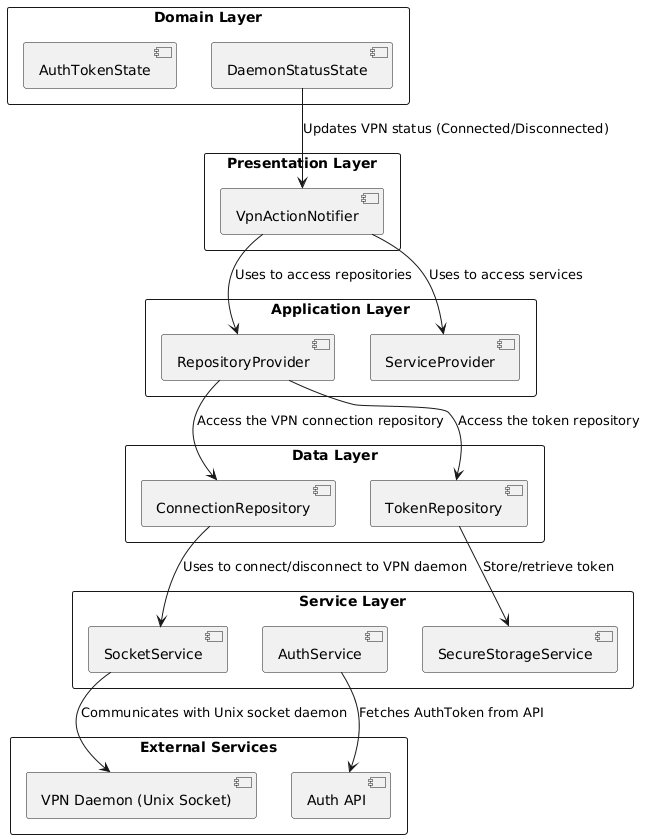

# VPN Control Application

This Flutter application provides a user-friendly interface for controlling a VPN daemon through socket communication, displaying the current connection status, and handling VPN actions such as connect and disconnect. The app polls the daemon status every 5 seconds and manages the lifetime of the authentication token to ensure smooth VPN operations.

## Table of Contents
- [Features](#features)
- [Requirements](#requirements)
- [Recommended IDE](#recommended-ide)
- [Architecture](#architecture)
- [Folder Structure](#folder-structure)
- [Libraries & Packages](#libraries--packages)
- [Setup and Installation](#setup-and-installation)
- [Running the App](#running-the-app)
- [Running the Daemon-Lite](#running-the-daemon-lite)
- [Testing](#testing)
- [macOS Packaging](#macos-packaging)
- [Limitations & Future Work](#limitations--future-work)

## Features
- **Daemon Communication**: Interacts with a mock VPN daemon via UNIX sockets.
- **Polling**: Continuously polls the daemon status every 5 seconds.
- **Connection Control**: Provides buttons for connecting and disconnecting the VPN.
- **Error Handling**: Displays user-friendly error messages when issues occur during communication with the VPN daemon or when network issues are encountered.
- **Debouncing**: Ensures that rapid successive VPN actions (connect/disconnect) are debounced to avoid unnecessary socket connections or failures.
- **Token Management**: Manages the lifetime of the authentication token (valid for 5 minutes).

## Requirements
- **Flutter**: Version 3.10.0 or above
- **Dart**: Version 3.0 or above
- **macOS/Linux**: Required to use UNIX sockets for communication with the daemon.

## Recommended IDE
The recommended IDE for working on this project is **Visual Studio Code**.

## Architecture

This project follows a **Layered Architecture** approach that enforces separation of concerns, making the code more modular, scalable, and testable.

The project is divided into the following layers:

- **Presentation Layer**: Handles the UI and user interaction.
- **Application Layer**: Manages state and business logic through Riverpod providers.
- **Domain Layer**: Contains the core business logic, including models and error handling.
- **Data Layer**: Responsible for interacting with external services like the VPN daemon or token repositories.

The following diagram illustrates the flow of data and interactions between these layers:


## Folder Structure

```
lib/
 ├── application/
 │    └── providers/
 │         ├── daemon_error_provider.dart
 │         ├── status_check_notifier.dart
 │         ├── vpn_action_notifier.dart
 ├── core/
 │    └── utils/
 │         └── logger.dart
 ├── data/
 │    ├── repositories/
 │    │    ├── daemon_connection_repository.dart
 │    │    └── token_repository.dart
 │    └── services/
 │         ├── api_config.dart
 │         ├── auth_service.dart
 │         ├── socket_service.dart
 ├── domain/
 │    ├── errors/
 │    │    ├── data_source_exception.dart
 │    │    └── network_exception.dart
 │    └── models/
 │         ├── auth/
 │         └── daemon/
 ├── presentation/
 │    └── screens/
 │         └── daemon_status_screen.dart
 └── main.dart
```

### Key Folders:
- **application**: Contains providers that manage the state and business logic for the app.
- **core**: Contains utility classes such as logging.
- **data**: Handles external service interactions, including the connection to the daemon and token management.
- **domain**: Contains models, errors, and business logic.
- **presentation**: Contains the UI, with a primary screen for the VPN control interface.

## Libraries & Packages
The following packages are used in the project:

| Package                | Purpose                                                       |
|------------------------|---------------------------------------------------------------|
| `flutter_riverpod`      | State management for handling daemon status and actions.      |
| `freezed_annotation`    | Data class immutability and union types for error handling.   |
| `flutter_secure_storage`| Storing sensitive data securely (e.g., tokens).              |
| `dio`                   | HTTP client for API requests.                                |
| `build_runner`          | Code generation for `freezed` and `riverpod` annotations.     |
| `json_serializable`     | Automatically generating JSON serialization boilerplate.     |
| `logging`               | Structured logging throughout the app.                       |
| `mocktail`              | Unit testing with mocks.                                     |

## Setup and Installation

### Prerequisites
- Ensure you have **Flutter** installed:
  ```bash
  flutter --version
  ```
  Confirm it is at least version `3.10.0`.

- Ensure you have **Dart** installed:
  ```bash
  dart --version
  ```
  Confirm it is at least version `3.0.0`.

### Installation Steps
1. **Clone the repository**:
   ```bash
   git clone https://github.com/CuriousDev21/ZTClient-Flutter.git
   cd cloudflare_zt_flutter
   ```

2. **Install dependencies**:
   ```bash
   flutter pub get
   ```

3. **Generate necessary files** (e.g., for `freezed` and `riverpod`):
   ```bash
   flutter pub run build_runner build --delete-conflicting-outputs
   ```

## Running the App
To run the app, specify the platform target (e.g., Android, iOS, macOS):

```bash
flutter run -d ios       # iOS
flutter run -d android   # Android
flutter run -d macos     # macOS Desktop
flutter run -d chrome    # Web (if enabled)
```

## Running the Daemon-Lite
Before running the application, you must start the mock `daemon-lite` on your system. This provides the VPN daemon service the app interacts with.

1. **Navigate to the `daemon-lite` directory** (where the daemon binary is stored):
   ```bash
   cd daemon-lite
   ```

2. **Start the daemon-lite** with default options:
   ```bash
   ./daemon-lite
   ```

   This will start the daemon listening on a UNIX socket at `/tmp/daemon-lite`.

3. Optionally, you can start the daemon with additional parameters such as:
   - **Failure rate** (`-f`): How often the requests should fail (once every X calls). For example:
     ```bash
     ./daemon-lite -f 3
     ```

   - **Connection timeout** (`-c`): The maximum amount of time the connect request can take to establish a connection (in milliseconds):
     ```bash
     ./daemon-lite -c 5000
     ```

   - **Disconnect timeout** (`-d`): The maximum amount of time the disconnect request can take to disconnect (in milliseconds):
     ```bash
     ./daemon-lite -d 3000
     ```

   You can see a list of all available parameters using:
   ```bash
   ./daemon-lite --help
   ```

## Testing
Unit tests are provided using the `mocktail` package for mocking service and repository layers.

Run all tests:
```bash
flutter test
```

### Key Testing Areas:
- **Daemon Interaction**: Ensures that the app can effectively communicate with the VPN daemon and handle edge cases.
- **Error Handling**: Ensures that errors from the daemon are handled appropriately and shown to the user.
- **Token Management**: Ensures the auth token is fetched, cached, and refreshed as needed.

## macOS Packaging

The application has already been packaged as a **DMG (Disk Image)** file, which is included in the project repository under the `build/macos/` directory.

### Steps to Install the DMG:
1. Navigate to the `build/macos/` directory.
2. Find the file `VPNControlApp.dmg`.
3. Double-click to open the DMG file.
4. Drag and drop the app into your Applications folder.

This allows users to easily install the app on macOS without needing to generate the DMG file themselves.

## Limitations & Future Work

### Limitations:
- The app runs perfectly on macOS and iOS. However, on Android, the `/tmp` path is reserved and cannot be used for socket communication. Altering the daemon to use another directory would have been required to make it work on Android emulators.
- Packaging the app as `.pkg` for macOS requires additional notarization, which wasn't possible without a Developer ID Installer Certificate.

### Future Work:
- **Support for Android**: In a real-world scenario, modifying the daemon to

 use a different socket path (instead of `/tmp`) would be essential for supporting Android.
- **Daemon Code Refactor**: Potential improvements to the daemon itself could allow it to be more portable across different operating systems.
- **Notifications on Status Changes**: Adding OS-level notifications for VPN status changes would enhance user experience.
- **Improve Error Handling**: More advanced error handling mechanisms, such as retries with exponential backoff, could be introduced for robustness.
- **Localization Support**: Adding support for multiple languages would make the app more accessible to a wider audience.
- **Integration Testing**: Using tools like `Patrol` and `Patrol_CLI` to perform integration tests on the app's UI and interactions with a daemon instance.
